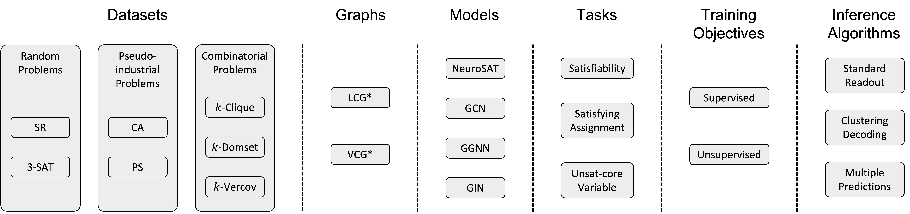

# G4SATBench



This is the official implementation of the paper

G4SATBench: Benchmarking and Advancing SAT Solving with Graph Neural Networks</br>
[Zhaoyu Li](https://www.zhaoyu-li.com), Jinpei Guo, and [Xujie Si](https://www.cs.toronto.edu/~six/)</br>

## Folder Structure
```
.
├── assets                                # Figures
├── external                              # External binary files (e.g., synthetic SAT generators, SAT solvers, etc.)
├── g4satbench
│   ├── data                              # PyG data/dataset/dataloader
│   ├── generators                        # Sythetic CNF generators and label generators
│   ├── models                            # GNN models
│   └── utils                             # Utilities like format printing, logs, etc.
├── scripts                               # Useful scripts
├── calc_stats.py                         # Calculate statistics of the generated datasets
├── eval_model.py                         # Evaluate the performance of a GNN model
├── pretrain_model.py                     # Pretrain a GNN model with augmented instances
└── train_model.py                        # Train a GNN model
```

## Installation
We recommend running the following lines to get started:

```bash
conda create -n g4satbench python=3.9
conda activate g4satbench
bash scripts/install.sh
```

## Datasets
We provide 7 synthetic SAT generators to produce CNF formulas in [the DIMACS format](http://www.satcompetition.org/2009/format-benchmarks2009.html).

An example SAT instance $(x_1 \lor x_2 \lor \neg x_3) \land (\neg x_2 \lor x_3)$ could be encoded as this:
```
p cnf 3 2
1 2 -3 0
-2 3 0
```

To generate our used SAT datasets, you can use the following scripts:

```bash
# our default data directory is ~/g4satbench, you can replace ~/g4satbench in the following scripts to your own data directory

# generate SAT datasets
bash scripts/gen_data.sh

# generate ground truth satisfying assignments and unsat-core variables
bash scripts/gen_label.sh

# generate augmented SAT datasets
bash scripts/gen_aug_data.sh

# calculate dataset statistics (optional)
bash scripts/calc_stats.sh
```

If you want to build your datasets with our provided generators in different settings (e.g., hyperparameters, dataset size) or add new generators, you may try to modify/add files in `g4satbench/generators/` and run the following line to construct the datasets:

```bash
python g4satbench/generators/<generator>.py ~/g4satbench/<difficulty>/<generator>/ --train_instances <train_instances> --valid_instances <valid_instances> --test_instances <test_instances> ...
```


## Benchmarking Evaluation
To reproduce our benchmarking experiments, you may run or modify these commands:

```bash
# train NeuroSAT on the easy SR dataset for satisfiability prediction
python train_model.py satisfiability ~/g4satbench/easy/sr/train/ --train_splits sat unsat --valid_dir ~/g4satbench/easy/sr/valid/ --valid_splits sat unsat --label satisfiability --graph lcg --model neurosat --n_iterations 32  --lr 1e-04 --weight_decay 1e-08 --scheduler ReduceLROnPlateau --batch_size 128 --seed 123

# evaluate NeuroSAT on the easy 3-sat dataset for satisfiability prediction
python eval_model.py satisfiability ~/g4satbench/easy/3-sat/test/ runs/train_task\=satisfiability_difficulty\=easy_dataset\=sr_splits\=sat_unsat/graph=lcg_init_emb=learned_model=neurosat_n_iterations=32_lr=1e-04_weight_decay=1e-08_seed=123/checkpoints/model_best.pt --test_splits sat unsat --label satisfiability --graph lcg --model neurosat --n_iterations 32 --batch_size 512
    
# train GGNN (VCG) on the easy CA dataset for satisfying assignment prediction with UNS_2 as the training loss
python train_model.py assignment ~/g4satbench/easy/ca/train/ --train_splits sat --valid_dir ~/g4satbench/easy/ca/valid/ --valid_splits sat --loss unsupervised_2 --graph vcg --model ggnn --n_iterations 32  --lr 1e-04 --weight_decay 1e-08 --scheduler ReduceLROnPlateau --batch_size 128 --seed 123

# evaluate GGNN (VCG) on the medium CA dataset for satisfying assignment prediction
python eval_model.py assignment ~/g4satbench/medium/ca/test/ runs/train_task\=assignment_difficulty\=easy_dataset\=ca_splits\=sat_label=None_loss=unsupervised_2/graph=vcg_init_emb=learned_model=ggnn_n_iterations=32_lr=1e-04_weight_decay=1e-08_seed=123/checkpoints/model_best.pt --test_splits sat --decoding standard --graph vcg --model ggnn --n_iterations 32 --batch_size 512

# train GIN (LCG) on the medium k-clique dataset for unsat-core variable prediction
python train_model.py core_variable ~/g4satbench/medium/k-clique/train/ --train_splits unsat --valid_dir ~/g4satbench/medium/k-clique/valid/ --valid_splits unsat --label core_variable --graph lcg --model gin --n_iterations 32  --lr 1e-04 --weight_decay 1e-08 --scheduler ReduceLROnPlateau --batch_size 128 --seed 123

# evaluate GIN (LCG) on the hard k-clique dataset for unsat-core variable prediction
python eval_model.py core_variable ~/g4satbench/hard/k-clique/test/ runs/train_task\=core_variable_difficulty\=medium_dataset\=k-clique_splits\=unsat/graph=lcg_init_emb=learned_model=gin_n_iterations=32_lr=1e-04_weight_decay=1e-08_seed=123/checkpoints/model_best.pt --test_splits unsat --label core_variable --graph lcg --model gin --n_iterations 32 --batch_size 512
```

## Advancing Evaluation
To reproduce our advancing experiments, you may run or modify these commands:

```bash
# train NeuroSAT on the augmented easy SR dataset for satisfiability prediction
python train_model.py satisfiability ~/g4satbench/easy/sr/train/ --train_splits augmented_sat augmented_unsat --valid_dir ~/g4satbench/easy/sr/valid/ --valid_splits augmented_sat augmented_unsat --label satisfiability --graph lcg --model neurosat --n_iterations 32  --lr 1e-04 --weight_decay 1e-08 --scheduler ReduceLROnPlateau --batch_size 128 --seed 123

# evaluate NeuroSAT on the augmented easy sr dataset for satisfiability prediction
python eval_model.py satisfiability ~/g4satbench/easy/sr/test/ runs/train_task\=satisfiability_difficulty\=easy_dataset\=sr_splits\=augmented_sat_augmented_unsat/graph=lcg_init_emb=learned_model=neurosat_n_iterations=32_lr=1e-04_weight_decay=1e-08_seed=123/checkpoints/model_best.pt --test_splits augmented_sat augmented_unsat --label satisfiability --graph lcg --model neurosat --n_iterations 32 --batch_size 512

# pretrain GGNN (vcg) on the original & augmented easy 3-sat dataset
python pretrain_model.py ~/g4satbench/easy/3-sat/train/ --train_splits sat augmented_sat unsat augmented_unsat --graph vcg --model ggnn --n_iterations 32  --lr 1e-04 --weight_decay 1e-08 --batch_size 128 --seed 123

# train pretrained GGNN (vcg) with on the easy 3-sat dataset for satisfiability prediction
python train_model.py satisfiability ~/g4satbench/easy/3-sat/train/ --train_splits sat unsat --checkpoint runs/pretrain_task=satisfiability_difficulty=easy_dataset=3-sat_splits=sat_augmented_sat_unsat_augmented_unsat/graph=vcg_init_emb=learned_model=ggnn_n_iterations=32_lr=0.0001_weight_decay=1e-08_seed=123/checkpoints/model_best.pt --valid_dir ~/g4satbench/easy/3-sat/valid/ --valid_splits sat unsat --label satisfiability --graph vcg --model ggnn --n_iterations 32  --lr 1e-04 --weight_decay 1e-08 --scheduler ReduceLROnPlateau --batch_size 128 --seed 123

# evaluate pretrained GGNN (vcg) on the easy 3-sat dataset for satisfiability prediction
python eval_model.py satisfiability ~/g4satbench/easy/3-sat/test/ runs/pretrain_task=satisfiability_difficulty=easy_dataset=3-sat_splits=sat_augmented_sat_unsat_augmented_unsat/graph=vcg_init_emb=learned_model=ggnn_n_iterations=32_lr=0.0001_weight_decay=1e-08_seed=123/train_task\=satisfiability_difficulty\=easy_dataset\=3-sat_splits\=sat_unsat/graph=vcg_init_emb=learned_model=ggnn_n_iterations=32_lr=1e-04_weight_decay=1e-08_seed=123/checkpoints/model_best.pt --test_splits sat unsat --label satisfiability --graph vcg --model ggnn --n_iterations 32 --batch_size 512

# train NeuroSAT on the medium SR dataset with random initialization for satisfying assignment prediction
python train_model.py assignment ~/g4satbench/medium/sr/train/ --train_splits sat --valid_dir ~/g4satbench/medium/sr/valid/ --valid_splits sat --loss unsupervised_2 --graph lcg --model neurosat --init_emb random --n_iterations 32  --lr 1e-04 --weight_decay 1e-08 --scheduler ReduceLROnPlateau --batch_size 128 --seed 123

# evaluate NeuroSAT on the medium SR dataset with random initialization for satisfying assignment prediction
python eval_model.py assignment ~/g4satbench/medium/sr/test/ runs/train_task\=assignment_difficulty\=medium_dataset\=sr_splits\=sat_label=None_loss=unsupervised_2/graph=lcg_init_emb=random_model=neurosat_n_iterations=32_lr=1e-04_weight_decay=1e-08_seed=123/checkpoints/model_best.pt --test_splits sat --decoding standard --graph lcg --model neurosat --n_iterations 32 --batch_size 512
```

## Extension
If you want to build different GNN architectures on the VCG* or LCG* representation of CNF formulas, you could implement the GNN models in `g4satbench/models/gnn.py`. If you want to develop GNN models on other graph representations, you could implement your graph formats in `g4satbench/data/data.py` and modify the corresponding `g4satbench/data/dataset.py` and `g4satbench/models/gnn.py`.